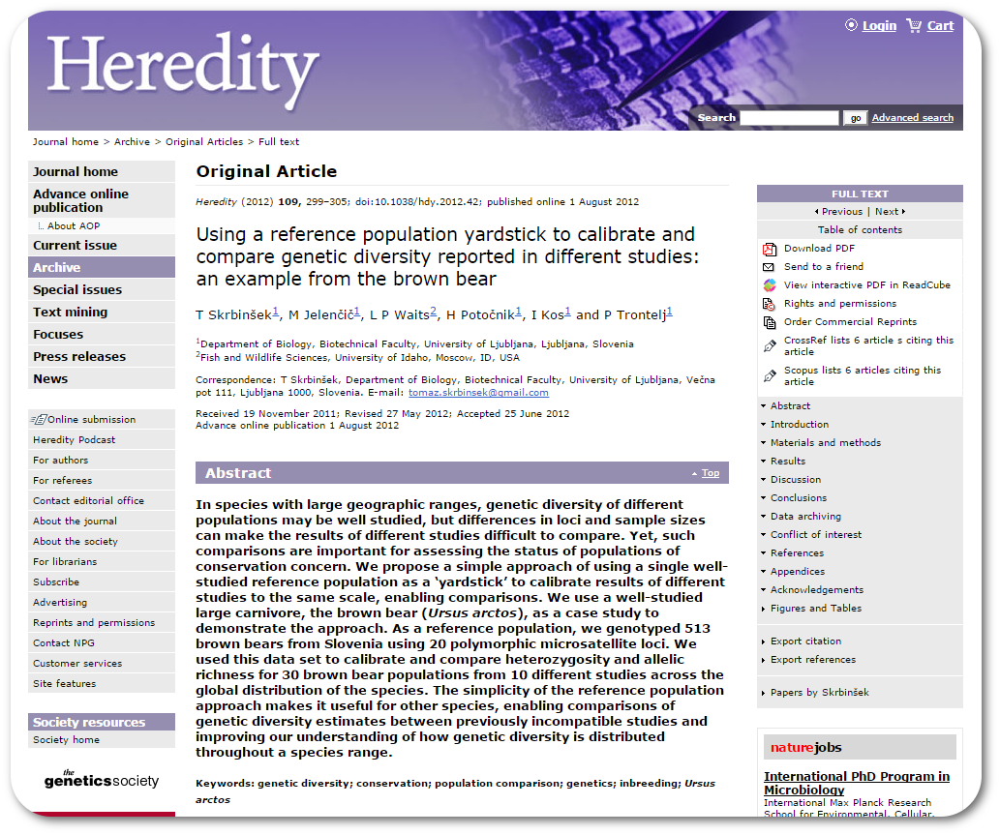

# Introduction

The following package contains data and workflow used in paper by Skrbinšek, Jelenčič Waits, Potočnik, Kos and Trontelj published in [journal Heredity in 2012](http://www.nature.com/hdy/journal/v109/n5/full/hdy201242a.html).


# How to install the package

The package on this repository is in its "raw" form, often referred to as `source`. If you are on Linux/OSX or if you have [Rtools](http://cran.r-project.org/bin/windows/Rtools/) and LaTeX installed, you will have no problem building the package from source by hand. This has been made easy using package `devtools` using the following commands (assuming your build chain is in place):

```R
library(devtools)
install_github("romunov/resamplediversity")
library(resamplediversity)
```

# Poking around

Next you will probably want to look at the data and work flow used in the paper. You can start by opening the vignette by typing `vignette("resamplediversity")` or by clicking on the PDF link through `browseVignettes()`.

# I don't know how to build from source

Contact package maintainer at `roman.lustrik@biolitika.si` and you will get a fresh binary package (.zip file) that you'll be able to install through `install.packages()`.